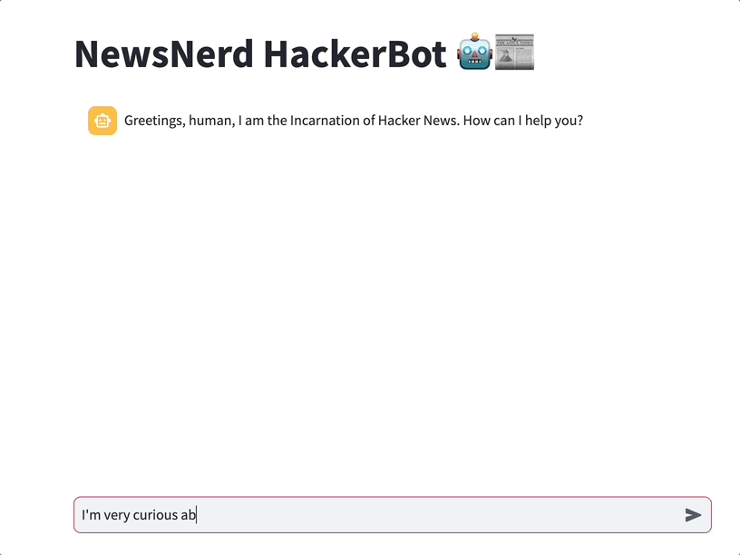
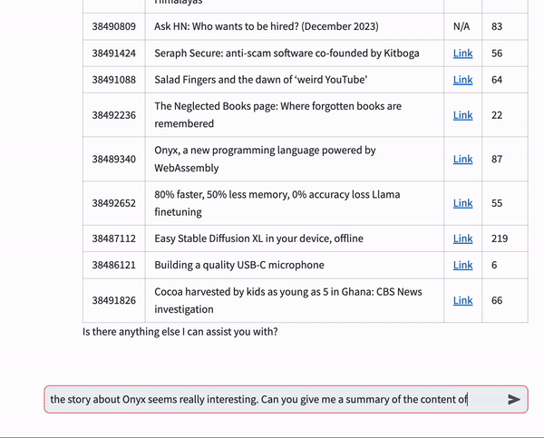

# NewsNerd HackerBot 🤖📰

Greetings, fellow news nerds! Welcome to the NewsNerd HackerBot, your ultimate companion for hacking into the latest tech scoops on Hacker News! 🕵️‍♂️💬


## Features 🚀

Right now, NewsNerd HackerBot is able to:

1. Get you the top, best, new, best, ask, show and job stories of
   Hacker News.
2. Filter the stories by any keyword / keywords you want (e.g. `Give me 20 stories about Sam Altman and OpenAI`)
3. Extract the comments from a story. You can use this to evaluate the general sentiment of the story.
4. Read blogs/articles linked to a story in order to reason about them

If you want to see them in action, check the examples down below!! 👇

## Examples 

#### 🔵 Get top stories about Q* 

)

#### 🔵 Sentiment analysis on comments


#### 🔵 Reading linked article



## Local Use

1. **Install dependencies:**
   ```bash
   pip install -r requirements.txt
   ```

2. **Run Streamlit application:**
   ```bash
   streamlit run newsnerd_hackerbot.py
   ```
