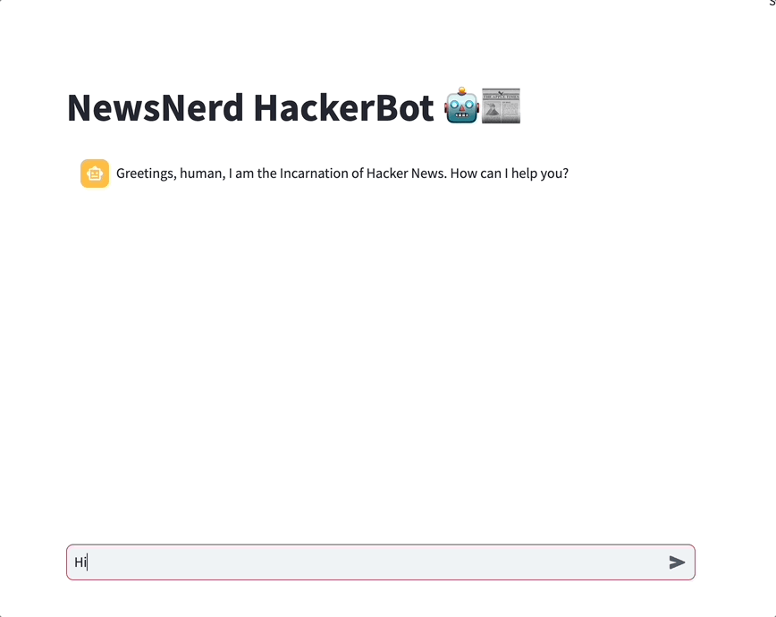

# NewsNerd HackerBot 🤖📰

Greetings, fellow news nerds! Welcome to the NewsNerd HackerBot, your ultimate companion for hacking into the latest tech scoops on Hacker News! 🕵️‍♂️💬



## Features 🚀

Right now, NewsNerd HackerBot is able to:

1. Get you the top, best, new, best, ask, show and job stories of
   Hacker News.
2. Gets you filter the stories by any keyword / keywords you want (e.g. `Give me 20 stories about Sam Altman and OpenAI`)


## Local Use

1. **Install dependencies:**
   ```bash
   pip install -r requirements.txt
   ```

2. **Run Streamlit application:**
   ```bash
   streamlit run newsnerd_hackerbot.py
   ```

## Next Steps

- Add tools to analyse the comments of a story
- Add tools to analyse the content of a URL (if it's a blogpost or similar)
